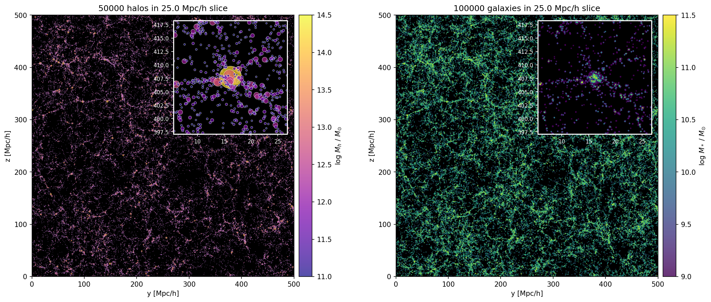

# Roman GRS PIT Covariance Mocks

Pipeline for generating mock galaxy catalogs from AbacusSummit halo catalogs using the rgrspit_diffsky package. This code generates large-scale covariance mocks for the Roman Galactic Redshift Survey (GRS) Project Infrastructure Team (PIT) analysis.

## Quick Start at NERSC

### Generate Mock Catalog and Figure

```bash
# Load environment and generate mock catalog
source scripts/load_env.sh
./scripts/make_mocks.sh

# For test mode (5000 halos, faster)
./scripts/make_mocks.sh --test

# Force regeneration of existing catalogs
./scripts/make_mocks.sh --force
```

### Manual Pipeline Steps

```bash
# 1. Load environment
source scripts/load_env.sh

# 2. Generate mock catalog
srun -n 6 --gpus-per-node=3 -c 32 --qos=interactive -N 2 --time=15 -C gpu -A m4943 python scripts/make_sfh_cov_mocks.py nersc /path/to/output/directory

# 3. Create visualization
python scripts/plot_mock_catalog.py /path/to/output/mock_catalog.hdf5
```

## Pipeline Overview

- **Input**: AbacusSummit halo catalogs (small box: 500 Mpc/h)
- **Galaxy Model**: rgrspit_diffsky package with star formation history modeling
- **Output**: HDF5 files containing galaxy positions, masses, and properties
- **Visualization**: Two-panel scatter plots showing galaxy and halo distributions

## Key Features

- **MPI Parallelization**: Scales across multiple GPUs/nodes
- **Slab Decomposition**: Efficient domain decomposition for large catalogs
- **Parallel HDF5**: Collective I/O operations for performance
- **Production Scale**: Designed for 40,000+ catalog generation runs

## Output Files

By default, output files are written to `$SCRATCH/grspit/covariance_mocks/data/`. To use a different directory, set the `GRS_COV_MOCKS_DIR` environment variable:

```bash
export GRS_COV_MOCKS_DIR="/path/to/your/output/directory"
```

Output files include:
- `mock_*.hdf5`: Galaxy catalog with positions, masses, and properties
- `mock_*.png`: Visualization showing galaxy and halo distributions
- `mocks.log`: Pipeline execution log

### Example Output Visualization

The pipeline generates two-panel scatter plots showing halo and galaxy distributions with zoom-in insets:



*Two-panel visualization: Left panel shows halos colored by mass with r100 virial radius scaling. Right panel shows galaxies colored by stellar mass. Both panels include zoom-in insets of a selected region.*

## Environment

The pipeline requires:
- NERSC Perlmutter system with GPU nodes
- Conda environment with JAX, rgrspit_diffsky, and scientific Python stack
- MPI support with parallel HDF5
